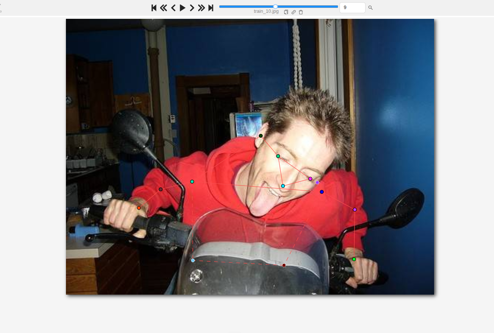
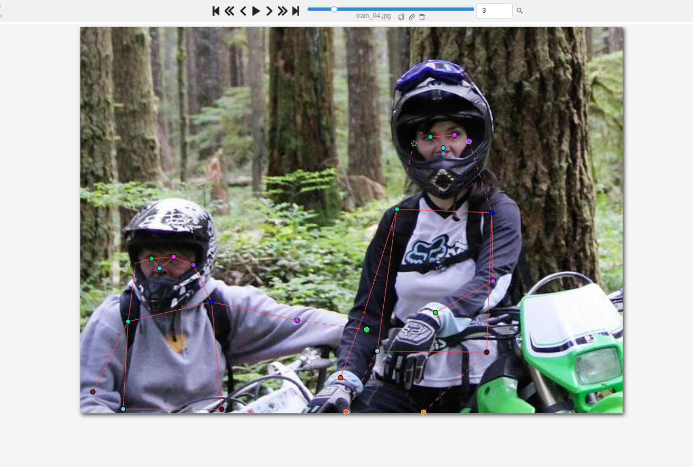
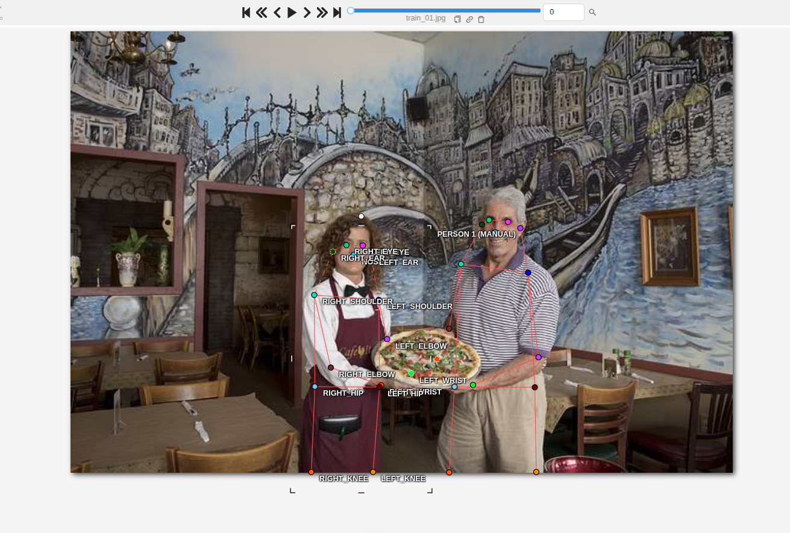
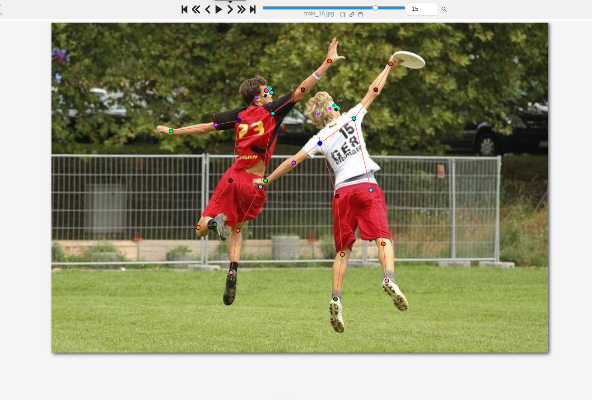
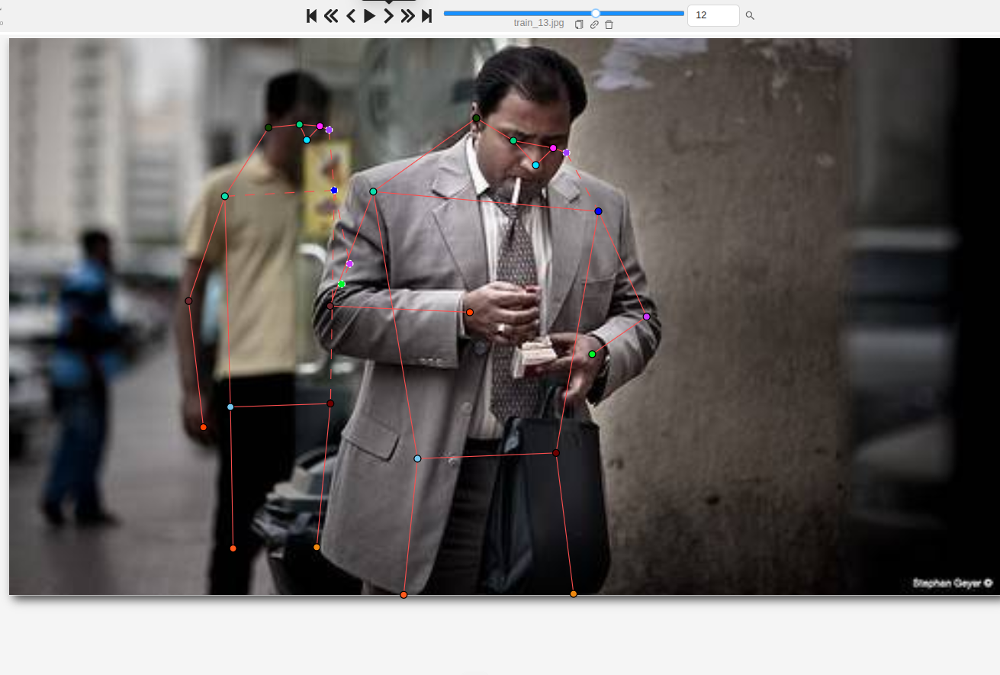
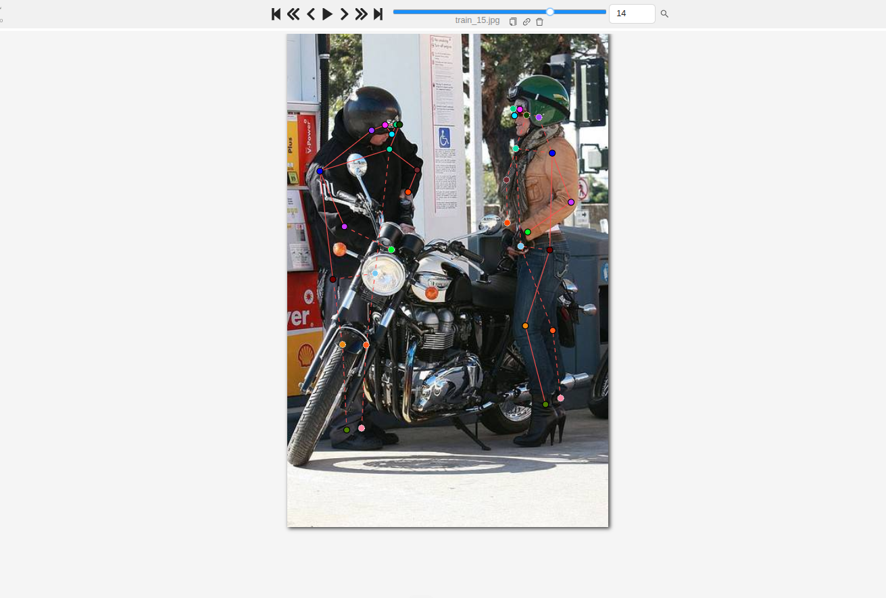
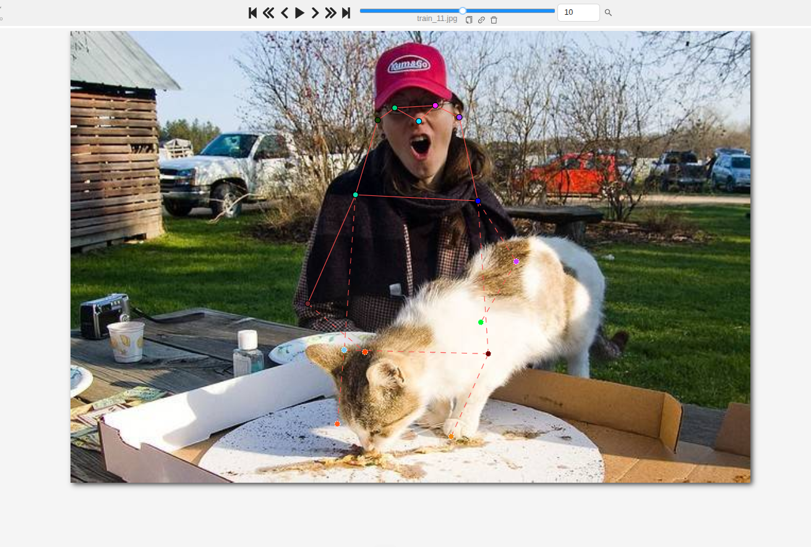

# Mini guideline - nhóm: HaiPH + duypx  |  người gán: HaiPH  |  ngày: 2026-09-16

> Điền file này **trong lúc** gán nhãn, không phải sau khi xong. Mỗi lần bạn dừng lại
> hơn 10 giây để phân vân, đó là một dòng phải ghi vào đây.

## 1. Luật bắt buộc (đã thống nhất cả lớp - không sửa)

- Bộ 17 điểm COCO, đúng tên, đúng thứ tự. Lấy từ file `.SVG` chung.
- Mọi người trong ảnh đều có **đủ 17 điểm**. Điểm không dùng được thì gắn cờ, không xoá.
- Trái/phải tính theo **cơ thể người**, không theo bức ảnh.
- Bị che, còn trong khung -> `v = 1`, **vẫn đặt chấm** ở vị trí ước lượng.
- Ra ngoài mép ảnh -> `v = 0`, **không** đặt chấm.
- Không dùng `Hidden` (`h`) - nó không được lưu vào file.

## 2. Luật của nhóm bạn (phải điền)

| Tình huống | Luật nhóm bạn chọn | Vì sao |
| --- | --- | --- |
| Hông của người mặc quần áo dài | Đặt chấm ở nếp gấp đùi - thân, ngang cạp quần hạ xuống một chút về phía ngoài. `v = 2` khi đường viền thân và cạp quần cho định vị chắc chắn; `v = 1` khi có vật che thêm lên trên (tay, túi, xe, bàn, người khác). Ảnh mẫu: `train_13` người 1 (`v = 2`), `train_10` người 1 (`v = 1`, bị xe che) | Hông không có bề mặt nhìn thấy trên người mặc quần áo, nên phải có mốc cố định. Hai bài lệch `%v=1` ở `left_hip` 18 điểm (25% / 7%) và 3 ảnh bị lệch vị trí hông -> trước đây chưa có mốc chung |
| Tai bị tóc hoặc mũ bảo hiểm che một phần | Vẫn đặt chấm ở vị trí tai ước lượng theo đường mắt - gáy, `v = 1`. Ảnh mẫu: `train_04`, `train_15` (mũ bảo hiểm) | Mũ không làm tai ra khỏi khung; tai là khớp `%v=1` cao nhất bài (`left_ear` 54%), cả hai người trùng nhau ở 54% nên luật này đã thống nhất |
| Người bị cắt ở mép ảnh (chỉ thấy từ hông trở lên) | Khớp nằm dưới mép ảnh -> `v = 0`, không đặt chấm. Khớp nằm sát mép nhưng vẫn trong khung -> kéo chấm vào trong ít nhất vài pixel. Hai khớp cùng cặp (hai hông, hai gối) quyết cùng nhau. Hông đã sát mép đáy thì gối và cổ chân là `v = 0`. Ảnh mẫu: `train_04` người 1 (bên trái), `train_10` người 1 | `train_04`: lần đầu `left_hip` bị kéo ra ngoài khung 1 px với `v = 2` -> checker chặn; hai hông cùng người lệch nhau 1 px mà một cái `v = 2` một cái `v = 0` là nhãn không nhất quán. `train_10`: hông ở 338-352 / 375 px, thử đặt gối thì rơi xuống y = 379 px -> ngoài khung, phải là `v = 0` |
| Cổ tay nằm sau tay lái / sau thân mình | `v = 1`, đặt chấm ước lượng theo hướng cẳng tay. Không bao giờ để `v = 0`. Ảnh mẫu: `train_01` người 1 và 2 | Lần chấm đầu có 2 lỗi `xoa_khop_bi_che` đúng ở hai cổ tay này (gold `v = 1`, bài `v = 0`) |
| Hai người chồng lên nhau | Làm xong hẳn người đứng trước rồi mới sang người sau. Khớp của người sau bị người trước che -> `v = 1`, chấm vẫn nằm trên cơ thể người sau. Ảnh mẫu: `train_13`, `train_16` | Tránh lỗi nhầm người; `train_16` hai cầu thủ chồng nhau nhưng không có lỗi `nham_nguoi` khi làm theo thứ tự này |
| Người nhỏ đến mức nào thì không gán nữa | Người nhỏ, mờ ở nền, cỡ người đứng sát mép trái `train_13`, thì không gán. Ảnh mẫu: `train_13` | Cả hai người trong nhóm cùng không gán người này; `evaluate_pose_annotations.py` báo `thieu_nguoi`, đã hỏi giáo viên và được xác nhận không cần gán |

Với mỗi luật, chèn **một ảnh mẫu** (screenshot từ CVAT) thay vì chỉ viết một câu.
Slide 12 nói rõ: khớp không có bề mặt nhìn thấy được thì phải có ảnh mẫu, không phải
một câu văn chung chung.

### Ảnh mẫu (screenshot CVAT)

Chấm viền nét đứt trong CVAT = `v = 1` (bị che); khớp `v = 0` không có chấm.

**Hông của người mặc quần áo dài** + **Người bị cắt ở mép ảnh** - `train_10` người 1: hai hông nét đứt
(`v = 1`) sau kính chắn gió, không có chấm gối và cổ chân vì đã nằm dưới mép đáy ảnh (`v = 0`).

**Tai bị tóc hoặc mũ bảo hiểm che** + **Người bị cắt ở mép ảnh** - `train_04`: một tai của người lái xe bên
phải là chấm nét đứt nằm trong mũ bảo hiểm (`v = 1`); người lái xe bên trái bị cắt ở đáy ảnh, hai hông kéo
vào trong khung.

**Cổ tay nằm sau tay lái / sau thân mình** - `train_01`: cổ tay của cả hai người đều có chấm, không có
cổ tay nào bị bỏ trống với `v = 0`.

**Hai người chồng lên nhau** - `train_16`: hai cầu thủ chồng lên nhau khi bật nhảy, xương của mỗi người
nằm đúng trên cơ thể người đó.

**Người nhỏ đến mức nào thì không gán nữa** + **Hai người chồng lên nhau** - `train_13`: gán hai người
phía trước; người áo xanh nhỏ, mờ ở nền bên trái không gán.

## 3. Ba ca mơ hồ đã gặp (bắt buộc, ghi ít nhất 3)

### Ca 1 - ảnh `train_04`, người thứ `1` (người lái xe bên trái), khớp `left_hip`, `right_hip`

- Mơ hồ ở chỗ nào: người lái xe bên trái bị cắt ngang ở đáy ảnh đúng ngang hông. Hông nằm
  trong vài hàng pixel cuối hay đã ra ngoài khung là không phân biệt được bằng mắt.
- Bạn quyết thế nào: kéo **cả hai** chấm hông vào trong khung (y = 452 / 457 px), giữ `v = 2`.
  Gối, cổ chân để `v = 0` vì thật sự nằm dưới mép ảnh.
- Vì sao: vùng thân ngay trên đáy ảnh vẫn thấy đường viền hông; hai hông cùng người phải chung một
  quyết định. Bản đầu `left_hip` nằm ở y = 458 px với `v = 2` -> checker báo lỗi chặn.
- Nếu người khác quyết ngược lại thì model học sai cái gì: nếu một người để `v = 0`, model học rằng
  hông ở sát mép ảnh "không tồn tại", rồi bỏ sót hông của người ngồi thấp trong khung hình.

### Ca 2 - ảnh `train_15`, người thứ `1`, khớp toàn bộ cặp trái/phải

- Mơ hồ ở chỗ nào: người đội mũ bảo hiểm đen đứng nghiêng, gần như quay lưng lại, cúi về phía xe.
  Không thấy mặt nên không dùng mắt/mũi để biết người đó đang quay về hướng nào.
- Bạn quyết thế nào: xác định trái/phải theo hướng vai và thân, không theo mặt. Gold báo
  `dao_trai_phai` (OKS 0.394); đã hỏi giáo viên và được xác nhận giữ nguyên nhãn.
- Vì sao: khi không thấy mặt, chỉ còn **vai, thân và mũi giày** để biết người quay về hướng nào.
  Tự đứng vào tư thế đó rồi giơ tay trái lên. Ca này mơ hồ thật - công cụ và người gán đọc hướng
  người khác nhau.
- Nếu người khác quyết ngược lại thì model học sai cái gì: đảo trái/phải bị augmentation lật ảnh
  (`flip_idx`) dạy hai lần; model học rằng người quay lưng có tay trái nằm bên trái ảnh -> sai ở mọi
  ảnh người quay lưng.

### Ca 3 - ảnh `train_11`, người thứ `1`, khớp `left_knee`, `right_knee`, `left_hip`, `right_hip`

- Mơ hồ ở chỗ nào: người ngồi sau bàn picnic, bàn và con mèo che hết phần chân. Chân không thấy
  một chút nào nên khó đoán vị trí gối/cổ chân.
- Bạn quyết thế nào: đầu gối vẫn nằm trong khung ảnh (hông ở y ≈ 0.7, gối ở y = 372-383 / 427 px)
  -> theo luật lớp là `v = 1`, đặt chấm ước lượng dưới mặt bàn theo tư thế ngồi.
  Hai hông cũng đổi sang `v = 1` vì bị bàn và mèo che. Cổ chân giữ `v = 0`: người ngồi nên cổ chân
  ước lượng nằm dưới mép đáy ảnh.
- Vì sao: bị vật che không phải là ra ngoài khung. `check_pose_labels.py` cảnh báo đúng ca này
  ("4 khớp v=0 trong khi cả người nằm gọn giữa ảnh"). Ca ngược lại là `train_10` người 1: cùng cảnh
  báo đó nhưng hông đã sát đáy ảnh, gối thật sự ra ngoài khung, nên `v = 0` là đúng - cảnh báo
  của checker chỉ là gợi ý, phải tự kiểm toạ độ.
- Nếu người khác quyết ngược lại thì model học sai cái gì: `v = 0` dạy model rằng người ngồi sau
  bàn/xe "không có chân" -> model không học được đoán khớp bị che, OKS mất điểm ở mọi ca bị che.

## 4. Sau khi so visibility report với bạn cùng nhóm

- Khớp lệch `%v=1` nhiều nhất: `left_hip` (bạn `25%` / họ `7%`) và `left_wrist` (bạn `36%` / họ `21%`)
- Nguyên nhân là **guideline chưa rõ** hay **một trong hai bên gán sai**: guideline chưa rõ. Với hông,
  hai người chưa có mốc chung để chọn `v = 2` hay `v = 1` (bài bạn cùng nhóm có 3 ảnh lệch vị trí
  hông). Với cổ tay, tôi gắn `v = 1` nhiều hơn cho cổ tay sau tay lái/sau thân, nhưng lúc đầu lại để `v = 0` ở
  `train_01` -> không nhất quán ngay trong bài mình; đã sửa sang `v = 1` khi rework.
- Luật mới bổ sung vào mục 2 sau khi thống nhất: dòng **Hông** (mốc nếp gấp đùi - thân, `v = 1` khi
  có vật che thêm) và dòng **Cổ tay sau tay lái** (luôn `v = 1`, không bao giờ `v = 0`).
